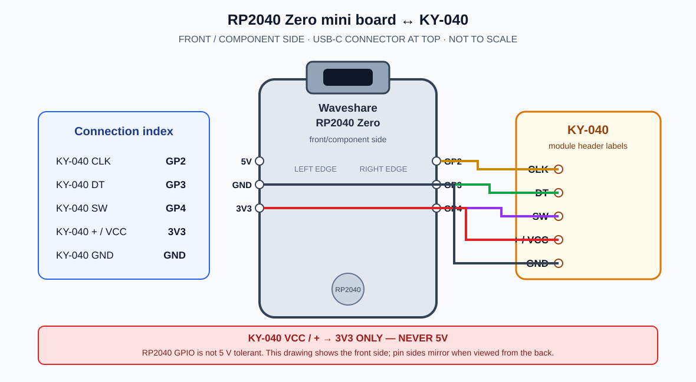

# RP2040 Zero ↔ KY-040 wiring

This document covers only the encoder input wiring for the active RP2040 Zero target. It does not connect the legacy ESP8266 SWC voltage-ladder outputs or head-unit KEY1/KEY2 lines.

## Connections

| KY-040 module pin | Waveshare RP2040 Zero pin | Signal |
|---|---|---|
| CLK | GP2 | Encoder A |
| DT | GP3 | Encoder B |
| SW | GP4 | Push switch (active low) |
| `+` / VCC | 3V3 | Module supply and pull-up rail |
| GND | GND | Common return |

The diagram uses the **front/component side**, with the USB-C connector at the top.
On the RP2040 Zero mini-board, GP2/GP3/GP4 are consecutive pins along the right
edge; 3V3 and GND are on the left edge. Pin positions mirror when viewing the
back side, so verify orientation before wiring.

The RP2040 GPIO is 3.3 V logic and is not 5 V tolerant. Power the KY-040 from the RP2040 Zero's **3V3 pin, never 5 V**. Do not leave the module VCC unconnected: its onboard pull-ups need a defined 3.3 V reference. USB-C powers/programs the RP2040 Zero; it does not replace the five signal/power connections above.

The RP2040 Zero supports USB host and device operation. This project uses its USB **device** connection to enumerate to the Android unit as HID. HID provides input reports only; it cannot directly invoke an Android app or intent. Do not connect the old ESP8266 KEY1/KEY2 analog circuitry to these GPIOs.

## Software selection

Use the Arduino-Pico core with the built-in Pico SDK USB stack for the documented `Keyboard` API. The alternate Adafruit TinyUSB stack has different APIs and is not assumed by this sketch. USB VID/PID values are not hard-coded here: the core/board configuration supplies defaults. These defaults are not a project-assigned identity; obtain/use an appropriately assigned VID/PID before production distribution.

## References

- [Waveshare RP2040-Zero wiki](https://www.waveshare.com/wiki/RP2040-Zero) — board features and pinout.
- [Arduino-Pico USB documentation](https://arduino-pico.readthedocs.io/en/latest/usb.html) — USB stacks, Keyboard support, and VID/PID configuration.
